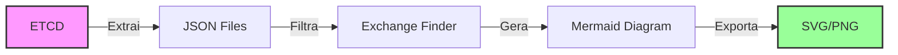
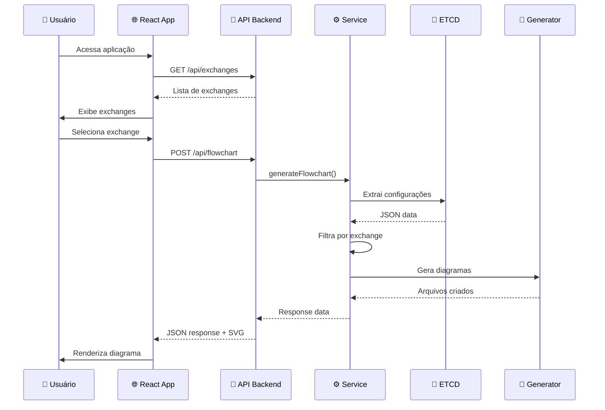

<div align="center">

# 🔄 ETCD Flowchart API + Frontend

### Transforme suas configurações ETCD em diagramas de fluxo interativos

[](https://nodejs.org/)
[](https://reactjs.org/)
[](https://www.typescriptlang.org/)
[](LICENSE)
[](CONTRIBUTING.md)

**API REST moderna + Frontend React/TypeScript + CLI poderosa** para extração de configurações do ETCD e geração automática de diagramas de fluxo usando Mermaid.js

[🚀 Início Rápido](#-início-rápido) • [📖 Documentação](#-documentação-completa) • [🎯 Exemplos](#-exemplos-de-uso) • [🛠️ Deploy](#-deployment)

</div>

---

## 📋 Índice

- [✨ Features](#-features)
- [🎯 Por que usar?](#-por-que-usar)
- [🚀 Início Rápido](#-início-rápido)
- [📖 Documentação Completa](#-documentação-completa)
- [🏗️ Arquitetura](#️-arquitetura)
- [🔒 Segurança](#-segurança)
- [🎯 Exemplos de Uso](#-exemplos-de-uso)
- [🛠️ Deployment](#️-deployment)
- [🤝 Contribuindo](#-contribuindo)

---

## ✨ Features

<table>
  <tr>
    <td width="50%">

      ### 🎨 Geração de Diagramas

      - ✅ Diagramas Mermaid automáticos
      - ✅ Múltiplos formatos: MMD, SVG, PNG
      - ✅ Visualização de fluxos complexos
      - ✅ Customização de estilos

    </td>
    <td width="50%">

      ### 🌐 Frontend Moderno

      - ✅ React 18 + TypeScript
      - ✅ TailwindCSS + Shadcn/ui
      - ✅ Visualização interativa de diagramas
      - ✅ Busca e filtros em tempo real

    </td>
  </tr>
  <tr>
    <td width="50%">

      ### 🚀 API REST Moderna

      - ✅ Endpoints RESTful otimizados
      - ✅ Resposta JSON simplificada
      - ✅ Validação robusta (Joi)
      - ✅ CORS e Helmet configurados

    </td>
    <td width="50%">

      ### 💾 Gerenciamento ETCD

      - ✅ Conexão direta ao ETCD
      - ✅ Extração automática de configs
      - ✅ Filtros inteligentes
      - ✅ Cache em JSON local

    </td>
  </tr>
  <tr>
    <td width="50%">

### 🛡️ Segurança & Performance

- ✅ Sanitização de inputs
- ✅ Proteção contra injection
- ✅ Logging estruturado (Winston)
- ✅ Error handling centralizado

</td>
<td width="50%">

### 🖥️ CLI Poderosa

- ✅ Comandos intuitivos
- ✅ Feedback visual
- ✅ Múltiplas operações
- ✅ Integração com scripts

</td>
</tr>
</table>

---

## 🎯 Por que usar?

### 🔍 Problema

Gerenciar configurações distribuídas no ETCD é complexo:

- Difícil visualizar dependências entre serviços
- Configurações espalhadas em múltiplas chaves
- Falta de documentação visual dos fluxos
- Debugging manual e demorado

### 💡 Solução

Este projeto oferece:



### 🎁 Benefícios

- **⚡ Rápido**: Gere diagramas em segundos
- **🎯 Preciso**: Visualize fluxos exatos
- **🔄 Atualizado**: Sempre sincronizado com ETCD
- **📊 Visual**: Diagramas prontos para documentação
- **🤖 Automatizável**: Integre em pipelines CI/CD

---

## 🚀 Início Rápido

### 📦 Pré-requisitos

- Node.js >= 16.x
- npm >= 8.x
- ETCD 3.x (rodando localmente ou remoto)
- Mermaid CLI (instalado automaticamente)

### 🔧 Instalação Completa (Backend + Frontend)

```bash
# 1. Clone o repositório
git clone https://github.com/chmenegatti/flow-cli.git
cd flow-cli

# 2. Instale as dependências do BACKEND
npm install

# 3. Configure o ambiente do backend
cp .env.example .env
# Edite o .env com suas configurações ETCD

# 4. Instale as dependências do FRONTEND
cd frontend
npm install

# 5. Configure o ambiente do frontend
cp .env.example .env

# 6. Volte para a raiz do projeto
cd ..
```

### ▶️ Executando o Projeto

#### Opção 1: Backend + Frontend separados (Desenvolvimento)

```bash
# Terminal 1 - Backend API (porta 3000)
npm start

# Terminal 2 - Frontend (porta 8080)
cd frontend
npm run dev
```

Acesse:

- **Frontend**: <http://localhost:8080>
- **API Backend**: <http://localhost:3000>
- **API Health Check**: <http://localhost:3000/api/health>

#### Opção 2: Somente Backend (API)

```bash
# Inicie o servidor
npm start

# Ou com PM2 (produção)
npm run prod
```

```

### ⚙️ Configuração Rápida

Edite o arquivo `.env`:

```env
# Servidor
PORT=3000
NODE_ENV=development

# ETCD (altere para seu host)
ETCD_HOSTS=127.0.0.1:2379

# Diretórios
JSON_DIR=./json
OUTPUT_DIR=./output

# Logging
LOG_LEVEL=info
```

### 🎬 Primeiro Uso

#### Via API

```bash
# 1. Iniciar o servidor
npm start

# 2. Fazer uma requisição
curl -X POST http://localhost:3000/api/flowchart \
  -H "Content-Type: application/json" \
  -d '{"exchange": "moirai.topic.vpn.delete"}'
```

#### Via CLI

```bash
# 1. Extrair dados do ETCD
npm run cli -- -g

# 2. Gerar diagrama
npm run cli -- -e moirai.topic.vpn.delete -o meu-diagrama
```

**Pronto! 🎉** Seus diagramas estão em `./output/`

---

## 📖 Documentação Completa

### 🌐 API REST

#### Endpoints Disponíveis

| Método | Endpoint | Descrição |
|--------|----------|-----------|
| `GET` | `/api/health` | Health check |
| `GET` | `/api/exchanges` | Lista exchanges disponíveis |
| `POST` | `/api/flowchart` | Gera flowchart |
| `GET` | `/` | Info da API |

#### 📤 POST /api/flowchart

**Request:**

```json
{
  "exchange": "moirai.topic.vpn.delete",
  "filename": "vpn-flow"  // Opcional
}
```

**Response (200 OK):**

```json
{
  "success": true,
  "message": "Flowchart generated successfully",
  "data": {
    "exchange": "moirai.topic.vpn.delete",
    "resultsCount": 5,
    "results": [
      {
        "exchange": "moirai.topic.vpn.delete",
        "etcd": "moirai-api-env-prod",
        "this": "v1.1.moirai.vpn.create",
        "next": "v1.2.moirai.vpn.validate",
        "error": "v1.1.moirai.vpn.create.error"
      }
    ]
  }
}
```

**Arquivos Gerados:**

- `output/vpn-flow.json` - Dados filtrados
- `output/vpn-flow.mmd` - Código Mermaid
- `output/vpn-flow.svg` - Diagrama vetorial
- `output/vpn-flow.png` - Diagrama bitmap (alta resolução)

#### 📋 GET /api/exchanges

Lista todas as exchanges distintas que começam com um prefixo específico (padrão: "moirai"), ordenadas alfabeticamente.

**Query Parameters:**

- `prefix` (opcional) - Prefixo para filtrar exchanges. Default: `moirai`

**Request:**

```bash
GET /api/exchanges
# ou com prefixo customizado
GET /api/exchanges?prefix=nemesis
```

**Response (200 OK):**

```json
{
  "success": true,
  "message": "Exchanges retrieved successfully",
  "data": {
    "prefix": "moirai",
    "count": 12,
    "exchanges": [
      "moirai.topic.network.create",
      "moirai.topic.network.delete",
      "moirai.topic.sdnvpn.create",
      "moirai.topic.sdnvpn.delete",
      "moirai.topic.vm.create",
      "moirai.topic.vm.delete",
      "moirai.topic.vpn.create",
      "moirai.topic.vpn.delete"
    ]
  }
}
```

**Exemplo com cURL:**

```bash
# Listar exchanges que começam com 'moirai'
curl http://localhost:3000/api/exchanges

# Listar exchanges que começam com 'nemesis'
curl http://localhost:3000/api/exchanges?prefix=nemesis

# Listar todas as exchanges
curl http://localhost:3000/api/exchanges?prefix=
```

#### ⚠️ Códigos de Erro

| Código | Descrição | Exemplo |
|--------|-----------|---------|
| `400` | Validação falhou | Exchange inválido |
| `404` | Rota não encontrada | URL incorreta |
| `500` | Erro interno | ETCD offline |

---

### 💻 CLI (Command Line Interface)

#### Comandos Disponíveis

```bash
flow-cli [options]

Options:
  -g, --generate                    Extrai dados do ETCD
  -e, --exchange <exchange>         Nome do exchange
  -o, --output <filename>           Nome do arquivo de saída
  -d, --diagram <jsonfile>          Gera de JSON existente
  -h, --help                        Exibe ajuda
  -V, --version                     Exibe versão
```

#### 📚 Exemplos CLI

```bash
# Extrair configurações do ETCD
npm run cli -- -g

# Gerar diagrama específico
npm run cli -- -e moirai.topic.vpn.delete -o vpn-diagram

# Regenerar de JSON existente
npm run cli -- -d vpn-diagram.json

# Ver ajuda
npm run cli -- --help
```

---

## 🏗️ Arquitetura

### 📂 Estrutura de Diretórios

```
flow-cli/
├── 📁 src/                         # Código fonte do Backend
│   ├── 📁 clients/                 # Clientes externos
│   │   └── EtcdClient.js          # Cliente ETCD
│   ├── 📁 config/                  # Configurações
│   │   └── index.js               # Config centralizada
│   ├── 📁 extractors/              # Extratores de dados
│   │   └── Extractor.js           # Extrator ETCD
│   ├── 📁 finders/                 # Buscadores
│   │   └── ExchangeFinder.js      # Busca por exchange
│   ├── 📁 generators/              # Geradores
│   │   └── MermaidFlowchartGenerator.js
│   ├── 📁 middlewares/             # Middlewares Express
│   │   ├── errorHandler.js        # Tratamento de erros
│   │   └── validation.js          # Validação Joi
│   ├── 📁 readers/                 # Leitores
│   │   └── JsonFileReader.js      # Leitor de JSON
│   ├── 📁 routes/                  # Rotas HTTP
│   │   └── api.js                 # Rotas da API
│   ├── 📁 savers/                  # Salvadores
│   │   └── JsonSaver.js           # Salva em JSON
│   ├── 📁 services/                # Serviços
│   │   ├── FlowchartService.js    # Orquestração flowchart
│   │   └── ExchangeService.js     # Gerenciamento exchanges
│   ├── 📁 utils/                   # Utilitários
│   │   └── logger.js              # Logger Winston
│   └── server.js                   # Servidor Express
├── 📁 frontend/                    # Aplicação Frontend
│   ├── 📁 src/
│   │   ├── 📁 components/          # Componentes React
│   │   │   ├── FlowchartViewer.tsx
│   │   │   ├── ExchangeCard.tsx
│   │   │   ├── Header.tsx
│   │   │   └── ui/                 # Shadcn/ui components
│   │   ├── 📁 pages/               # Páginas
│   │   │   ├── Index.tsx
│   │   │   └── NotFound.tsx
│   │   ├── 📁 services/            # Serviços API
│   │   │   └── api.ts
│   │   ├── 📁 types/               # TypeScript types
│   │   │   └── exchange.ts
│   │   ├── 📁 hooks/               # Custom hooks
│   │   └── App.tsx
│   ├── package.json
│   ├── vite.config.ts
│   └── tailwind.config.ts
├── 📁 json/                        # Dados ETCD (gerados)
├── 📁 output/                      # Diagramas (gerados)
├── 📁 logs/                        # Logs da aplicação
├── flow-cli.js                     # CLI entry point
├── package.json                    # Dependências Backend
├── .env.example                    # Exemplo de config
└── README.md                       # Você está aqui!
```

### 🔄 Fluxo de Dados



### 🧩 Arquitetura do Frontend

O frontend é uma Single Page Application (SPA) construída com:

- **React 18**: Framework UI reativo
- **TypeScript**: Type safety e melhor DX
- **TailwindCSS**: Utility-first CSS framework
- **Shadcn/ui**: Componentes acessíveis e estilizados
- **TanStack Query**: Data fetching e cache
- **Mermaid**: Renderização de diagramas
- **Vite**: Build tool ultra-rápido

**Principais Componentes:**

```typescript
<Index>                      // Página principal
├── <Header>                // Cabeçalho com stats
├── <SearchInput>           // Busca de exchanges
├── <ExchangeCard>          // Card de exchange (grid)
└── <FlowchartViewer>       // Modal com diagrama
    └── Mermaid rendering   // Renderização do SVG
```

### 🎯 Design Patterns

- **📦 Modular Architecture**: Separação clara de responsabilidades
- **🔌 Dependency Injection**: Fácil teste e manutenção
- **🛡️ Middleware Pattern**: Validação e error handling
- **🎨 Service Layer**: Lógica de negócio isolada
- **📝 Repository Pattern**: Acesso a dados abstraído

---

## 🔒 Segurança

### 🛡️ Medidas Implementadas

| Feature | Tecnologia | Descrição |
|---------|-----------|-----------|
| **Headers** | Helmet.js | Headers HTTP seguros |
| **CORS** | cors | Cross-Origin configurado |
| **Validação** | Joi | Schemas de validação |
| **Sanitização** | Custom | Limpeza de inputs |
| **Logging** | Winston | Auditoria completa |
| **Env Vars** | dotenv | Secrets seguros |

### 🔐 Boas Práticas

```javascript
// ✅ Sanitização de inputs
const sanitizeFilename = (filename) => {
  return filename.replace(/[^a-zA-Z0-9_-]/g, '_');
};

// ✅ Validação com Joi
const schema = Joi.object({
  exchange: Joi.string()
    .required()
    .pattern(/^[a-zA-Z0-9._-]+$/)
});

// ✅ Proteção contra command injection
const execPromise = promisify(exec);
const command = `mmdc -i "${sanitizedPath}" -o "${outputPath}"`;
await execPromise(command);
```

### 🔍 Auditoria

Todos os eventos são logados:

```bash
# Ver logs em tempo real
tail -f logs/app.log

# Ver apenas erros
tail -f logs/error.log
```

---

## 🎯 Exemplos de Uso

### 🌐 Integração JavaScript/TypeScript

```javascript
// Função auxiliar
async function generateFlowchart(exchange, filename = 'flowchart') {
  const response = await fetch('http://localhost:3000/api/flowchart', {
    method: 'POST',
    headers: { 'Content-Type': 'application/json' },
    body: JSON.stringify({ exchange, filename })
  });
  
  const data = await response.json();
  
  if (data.success) {
    console.log(`✓ ${data.data.resultsCount} resultados encontrados`);
    return data.data.results;
  }
  
  throw new Error(data.error);
}

// Uso
const results = await generateFlowchart('moirai.topic.vpn.delete');
```

### 🐍 Integração Python

```python
import requests

def generate_flowchart(exchange, filename='flowchart'):
    """Gera flowchart via API"""
    url = 'http://localhost:3000/api/flowchart'
    
    response = requests.post(url, json={
        'exchange': exchange,
        'filename': filename
    })
    
    data = response.json()
    
    if data['success']:
        print(f"✓ {data['data']['resultsCount']} resultados")
        return data['data']['results']
    
    raise Exception(data['error'])

# Uso
results = generate_flowchart('moirai.topic.vpn.delete')
```

### ⚛️ Integração React

```jsx
import { useState } from 'react';

function FlowchartGenerator() {
  const [exchange, setExchange] = useState('');
  const [results, setResults] = useState(null);
  const [loading, setLoading] = useState(false);

  const handleGenerate = async () => {
    setLoading(true);
    try {
      const res = await fetch('http://localhost:3000/api/flowchart', {
        method: 'POST',
        headers: { 'Content-Type': 'application/json' },
        body: JSON.stringify({ exchange })
      });
      
      const data = await res.json();
      if (data.success) setResults(data.data.results);
    } catch (error) {
      console.error(error);
    } finally {
      setLoading(false);
    }
  };

  return (
    <div>
      <input 
        value={exchange}
        onChange={(e) => setExchange(e.target.value)}
        placeholder="Exchange name"
      />
      <button onClick={handleGenerate} disabled={loading}>
        {loading ? 'Gerando...' : 'Gerar Flowchart'}
      </button>
      
      {results && (
        <ul>
          {results.map((r, i) => (
            <li key={i}>{r.this} → {r.next}</li>
          ))}
        </ul>
      )}
    </div>
  );
}
```

### 📜 Script Bash Automatizado

```bash
#!/bin/bash
# generate-all-diagrams.sh

EXCHANGES=(
  "moirai.topic.vpn.delete"
  "moirai.topic.vpn.create"
  "nemesis.topic.vm.provision"
)

for exchange in "${EXCHANGES[@]}"; do
  echo "🔄 Gerando: $exchange"
  
  curl -s -X POST http://localhost:3000/api/flowchart \
    -H "Content-Type: application/json" \
    -d "{\"exchange\": \"$exchange\"}" \
    | jq -r '.message'
  
  echo "✓ Concluído: $exchange"
  echo ""
done

echo "🎉 Todos os diagramas gerados!"
```

---

## 🛠️ Deployment

### 🐳 Docker

#### Dockerfile

```dockerfile
FROM node:18-alpine

WORKDIR /app

# Instalar dependências
COPY package*.json ./
RUN npm ci --only=production

# Instalar Chromium para Mermaid CLI
RUN apk add --no-cache chromium nss freetype harfbuzz

# Copiar código
COPY . .

# Criar diretórios
RUN mkdir -p json output logs

EXPOSE 3000

HEALTHCHECK --interval=30s --timeout=3s \
  CMD node -e "require('http').get('http://localhost:3000/api/health', (r) => process.exit(r.statusCode === 200 ? 0 : 1))"

CMD ["npm", "start"]
```

#### docker-compose.yml

```yaml
version: '3.8'

services:
  api:
    build: .
    ports:
      - "3000:3000"
    environment:
      - NODE_ENV=production
      - ETCD_HOSTS=etcd:2379
    volumes:
      - ./json:/app/json
      - ./output:/app/output
      - ./logs:/app/logs
    depends_on:
      - etcd
    restart: unless-stopped

  etcd:
    image: bitnami/etcd:latest
    environment:
      - ALLOW_NONE_AUTHENTICATION=yes
    ports:
      - "2379:2379"
    volumes:
      - etcd_data:/bitnami/etcd

volumes:
  etcd_data:
```

**Uso:**

```bash
docker-compose up -d
```

### 🚀 PM2 (Process Manager)

```bash
# Instalar PM2
npm install -g pm2

# Iniciar
pm2 start src/server.js --name etcd-flowchart-api

# Modo cluster (múltiplas instâncias)
pm2 start src/server.js -i max

# Monitorar
pm2 monit

# Logs
pm2 logs etcd-flowchart-api

# Auto-start on reboot
pm2 startup
pm2 save
```

### 🌐 Nginx Reverse Proxy

```nginx
server {
    listen 80;
    server_name api.example.com;

    location /api {
        proxy_pass http://localhost:3000;
        proxy_http_version 1.1;
        proxy_set_header Upgrade $http_upgrade;
        proxy_set_header Connection 'upgrade';
        proxy_set_header Host $host;
        proxy_set_header X-Real-IP $remote_addr;
        proxy_set_header X-Forwarded-For $proxy_add_x_forwarded_for;
        proxy_cache_bypass $http_upgrade;
    }
}
```

---

## 📊 Performance & Monitoramento

### 📈 Métricas

| Métrica | Valor |
|---------|-------|
| **Response Time** | < 100ms (sem geração) |
| **Throughput** | 100+ req/s |
| **Memory** | ~100MB base |
| **CPU** | ~5% idle |

### 🔍 Monitoramento

```bash
# Ver status do servidor
curl http://localhost:3000/api/health

# Logs em tempo real
tail -f logs/app.log | grep ERROR

# Uso de recursos (PM2)
pm2 monit
```

---

## 🧪 Testes

### ✅ Health Check

```bash
curl http://localhost:3000/api/health

# Resposta esperada:
{
  "success": true,
  "message": "API is running",
  "timestamp": "2025-12-10T..."
}
```

### 🧪 Teste Completo

```bash
# 1. Extrair ETCD
npm run cli -- -g

# 2. Gerar diagrama
curl -X POST http://localhost:3000/api/flowchart \
  -H "Content-Type: application/json" \
  -d '{"exchange": "moirai.topic.vpn.delete"}' \
  | jq '.'

# 3. Verificar arquivos
ls -lh output/
```

---

## 🐛 Troubleshooting

<details>
<summary><b>❌ Erro: "JSON directory does not exist"</b></summary>

**Causa:** Dados ainda não foram extraídos do ETCD

**Solução:**

```bash
npm run cli -- -g
```

</details>

<details>
<summary><b>❌ Erro: "ETCD connection refused"</b></summary>

**Causa:** ETCD não está rodando ou host incorreto

**Solução:**

1. Verificar ETCD: `curl http://127.0.0.1:2379/version`
2. Ajustar `.env`: `ETCD_HOSTS=seu-host:2379`

</details>

<details>
<summary><b>❌ Erro ao gerar PNG/SVG</b></summary>

**Causa:** Mermaid CLI não instalado ou Chromium ausente

**Solução:**

```bash
npm install
# Em Alpine Linux: apk add chromium
```

</details>

<details>
<summary><b>⚠️ Port 3000 em uso</b></summary>

**Solução:**

```env
# No .env
PORT=8080
```

</details>

---

## 📝 Scripts NPM

```json
{
  "start": "node src/server.js",       // Produção
  "dev": "nodemon src/server.js",      // Desenvolvimento
  "cli": "node flow-cli.js"            // CLI
}
```

---

## 🤝 Contribuindo

Contribuições são bem-vindas!

### 📋 Como contribuir

1. **Fork** o projeto
2. **Clone** seu fork: `git clone https://github.com/seu-usuario/flow-cli.git`
3. Crie uma **branch**: `git checkout -b feature/nova-feature`
4. **Commit** suas mudanças: `git commit -m 'feat: adiciona nova feature'`
5. **Push**: `git push origin feature/nova-feature`
6. Abra um **Pull Request**

### 📜 Padrões

- ✅ ESLint para código limpo
- ✅ Commits semânticos (feat, fix, docs, etc)
- ✅ Testes para novas features
- ✅ Documentação atualizada

---

## 📄 Licença

Este projeto está sob a licença **ISC**.

---

## 👤 Autor

**Carlos Menegatti**  
GitHub: [@chmenegatti](https://github.com/chmenegatti)

---

## 🙏 Agradecimentos

- [ETCD](https://etcd.io/) - Distributed configuration
- [Mermaid.js](https://mermaid.js.org/) - Diagram generation
- [Express.js](https://expressjs.com/) - Web framework
- [Winston](https://github.com/winstonjs/winston) - Logging

---

<div align="center">

### ⭐ Se este projeto foi útil, considere dar uma estrela

**[⬆ Voltar ao topo](#-etcd-flowchart-api)**

Made with ❤️ by [chmenegatti](https://github.com/chmenegatti)

</div>
